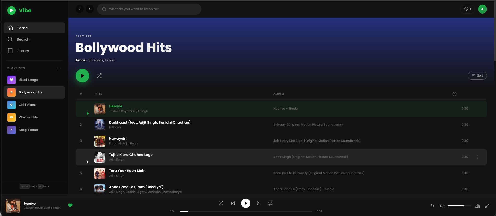
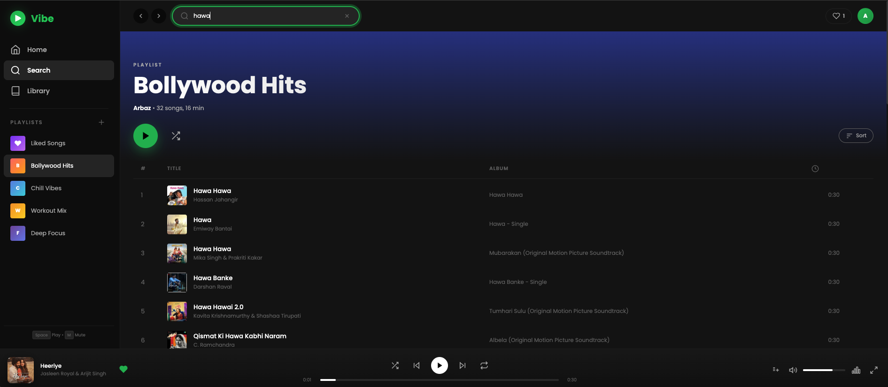
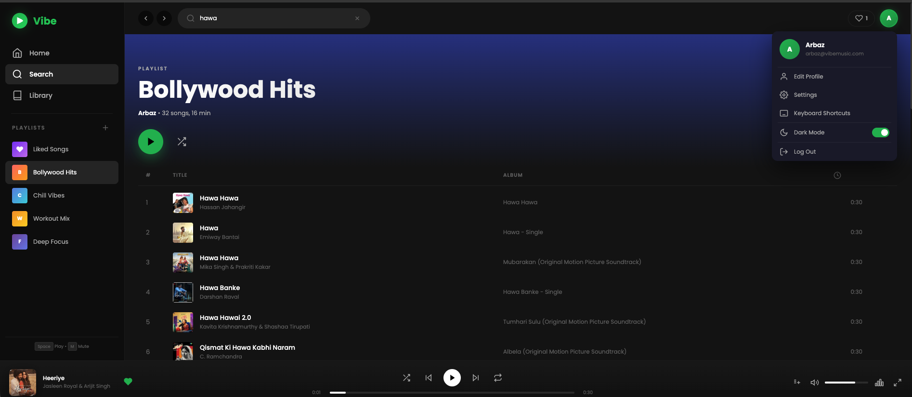
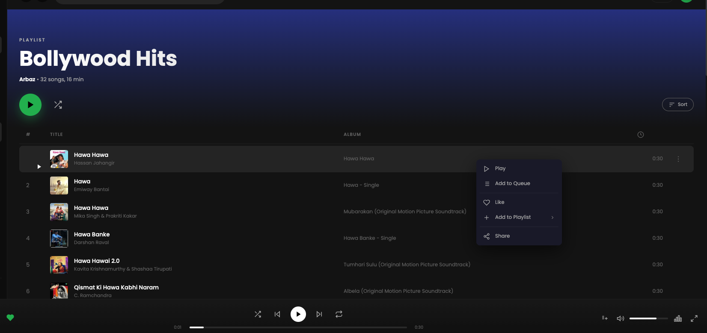
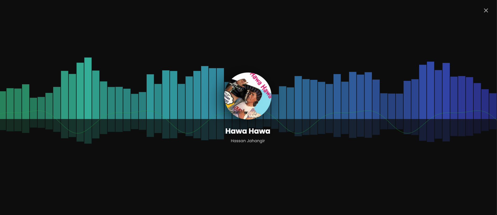

# Vibe Player - Spotify-Inspired Music Streaming UI

A fully functional music player web app built from scratch using **HTML**, **CSS**, and **JavaScript** — no frameworks, no libraries. Streams real songs via the iTunes Search API with album artwork, 30-second audio previews, and a complete Spotify-like dark UI.

## Screenshots

<div align="center">
  <h3>Main Interface</h3>
  
  <br><br>
  <div style="display: flex; flex-wrap: wrap; justify-content: center; gap: 10px;">
    
    
    
    
  </div>
</div>

## Live Features

### Music Playback
- Real song streaming via **iTunes Search API** (30-second previews with actual audio)
- Play, pause, next, previous track controls
- Seekable progress bar with time display
- Volume slider with mute toggle
- Shuffle and repeat modes (off / repeat all / repeat one)
- Auto-advances to the next track when a song ends

### Song Discovery
- **Live search** — type any artist, song, or genre and get real results from iTunes
- **Curated playlists** — Bollywood Hits, Chill Vibes, Workout Mix, Deep Focus
- **Sort songs** by title or artist (button shows the active sort mode)

### Liked Songs
- Heart any song to save it to your **Liked Songs** collection
- Dedicated favorites button in the top bar with a live count badge
- Liked songs persist across sessions via localStorage

### Queue System
- Add songs to a manual play queue
- **Drag and drop** to reorder the queue
- Remove individual songs or clear the entire queue

### Context Menu
- **Right-click** any song or tap the **3-dot menu** (⋮) for options:
  - Play
  - Add to Queue
  - Like / Unlike
  - Add to Playlist (submenu)
  - Share (copies to clipboard)
- Smart positioning — menu flips direction near screen edges so it never goes off-screen

### Visualizer
- Full-screen animated **canvas visualizer** with frequency-style bars
- Bouncing bars and wave animations react to playback state
- Album art spins in the center while playing

### Profile
- Editable profile (name + avatar color)
- Keyboard shortcuts reference panel
- Theme toggle (dark mode)

### Playlist Management
- Create custom playlists with a name
- Add songs to any playlist from the context menu
- Custom playlists are saved to localStorage

### Keyboard Shortcuts

| Key | Action |
|---|---|
| `Space` | Play / Pause |
| `Shift + →` | Next Track |
| `Shift + ←` | Previous Track |
| `→` / `←` | Seek forward / backward 5s |
| `↑` / `↓` | Volume up / down |
| `M` | Toggle Mute |
| `S` | Toggle Shuffle |
| `R` | Toggle Repeat |
| `L` | Like current song |
| `V` | Toggle Visualizer |
| `Q` | Toggle Queue panel |
| `F` | Toggle Fullscreen |
| `/` | Focus search bar |
| `Esc` | Close any overlay |

### Responsive Design
- Full sidebar on desktop, icon-only on tablet, minimal on mobile
- Album column hides on smaller screens
- Volume control hides on phones
- Queue panel adapts to available width

## Tech Stack

| Layer | Technology |
|---|---|
| Structure | Semantic HTML5 |
| Styling | CSS3 (Variables, Flexbox, Grid, Animations, Transitions, Media Queries) |
| Logic | Vanilla JavaScript (ES6+) |
| Audio | HTML5 Audio API |
| Visuals | Canvas 2D API |
| Data | iTunes Search API (REST, JSON, async/await) |
| Storage | localStorage |
| Font | Google Fonts (Poppins) |

## Project Structure

```
spotify-player/
├── index.html              # UI structure, modals, overlays
├── css/                    # Modular stylesheets
│   ├── base.css            # Reset, CSS variables, typography
│   ├── sidebar.css         # Sidebar, logo, nav menu, playlists
│   ├── topbar.css          # Top bar, search, favorites, profile
│   ├── hero.css            # Hero section, action buttons
│   ├── songlist.css        # Song list grid, items, equalizer
│   ├── player.css          # Bottom player bar, controls, volume
│   ├── queue.css           # Queue panel sidebar
│   ├── overlays.css        # Context menu, visualizer, modals
│   ├── responsive.css      # Media query breakpoints
│   └── style.css           # Monolithic stylesheet (backup)
├── js/                     # Modular JavaScript
│   ├── storage.js          # localStorage helpers (load/save)
│   ├── api.js              # iTunes Search API integration
│   ├── state.js            # App state variables, audio element
│   ├── dom.js              # DOM element references
│   ├── helpers.js          # Utility functions
│   ├── ui.js               # UI update functions
│   ├── queue.js            # Queue panel management
│   ├── contextmenu.js      # Right-click / 3-dot context menu
│   ├── visualizer.js       # Canvas-based audio visualizer
│   ├── songlist.js         # Song list rendering and loading
│   ├── player.js           # Audio playback, controls
│   ├── playlist.js         # Playlist switching, creation
│   ├── search.js           # Live search with debouncing
│   ├── profile.js          # Profile management
│   ├── events.js           # Event listeners
│   ├── app.js              # App initialization (entry point)
│   └── script.js           # Monolithic script (backup)
├── README.md               # Project documentation
└── screenshots/            # App screenshots for README
```

## How to Run

1. Clone or download this repository
2. Open `index.html` in any modern browser

Or serve it locally:

```bash
cd spotify-player
python3 -m http.server 8080
# Open http://localhost:8080
```

> No build step, no npm install, no dependencies — just open and play.

## API

This project uses the [iTunes Search API](https://developer.apple.com/library/archive/documentation/AudioVideo/Conceptual/iTuneSearchAPI/) which is free, requires no API key, and works directly from the browser. Songs are 30-second preview clips provided by Apple.

## Key Concepts Demonstrated

**HTML** — Semantic structure, SVG icons, forms, modals, accessibility attributes (aria roles, tabindex), data attributes

**CSS** — CSS custom properties, Flexbox & Grid layouts, keyframe animations, transitions, pseudo-elements, backdrop-filter, custom scrollbar, gradient backgrounds, responsive breakpoints with media queries

**JavaScript** — Async/await with Fetch API, DOM manipulation, event delegation, drag & drop API, Canvas 2D drawing, localStorage persistence, keyboard event handling, clipboard API, fullscreen API, debounced search, dynamic element creation, context menu positioning logic

---

Built by **Arbaz** as a frontend development portfolio project.
